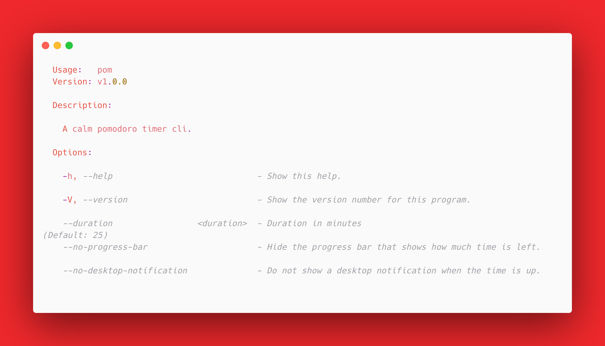

<h1 align="center">pom cli</h1>

<p align="center">
  
</p>

<p align="center">
  <i>A calm pomodoro timer cli.</i>
</p>

<p align="center">
  <a href="https://github.com/felixzieger/pom/actions/workflows/build.yaml">
    
  </a>
  <a href="https://github.com/felixzieger/pom/graphs/contributors">
    
  </a>
  <a href="https://github.com/felixzieger/pom/blob/main/LICENSE">
    
  </a>
  <a href="https://github.com/felixzieger/pom/releases">
    
  </a>
</p>

pom is a pomodoro timer for your command line. It's key features are:

- Single line install via `deno install`.
- Desktop notifications for linux, windows, mac os.
- Easily maintainable with less than 100 lines of code excluding external
  dependencies.

# 🎬 Getting Started

If you already have a [deno runtime](https://deno.land/#installation) installed
on your system, you can install and upgrade pom comfortably via:

```bash
deno install $(deno run https://raw.githubusercontent.com/felixzieger/pom/main/src/flags.ts) https://raw.githubusercontent.com/felixzieger/pom/main/src/main.ts
```

Start a 25 minute pomodoro timer:

```bash
pom
```

# 🖼️ Options

<p align="center">
  
</p>
